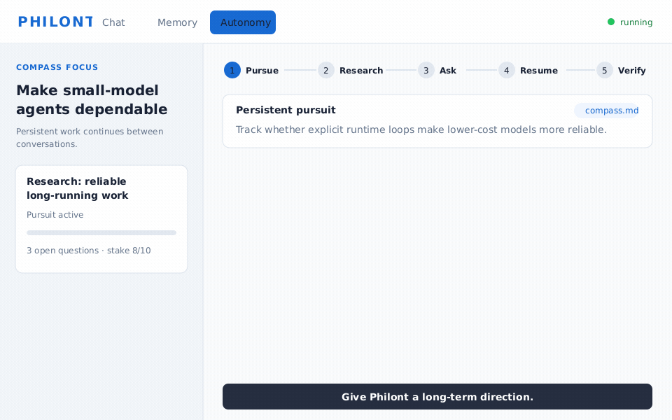

# Philont

<p align="center"><b>A self-hosted agent runtime designed to make smaller models dependable on long-running work.</b></p>

[](https://github.com/ruozhuoruoyu/Philont-Agent/actions/workflows/ci.yml)
[](LICENSE)
[](#current-maturity)
[](https://github.com/ruozhuoruoyu/Philont-Agent/wiki)

Give Philont a direction in `compass.md`. It keeps persistent pursuits across conversations, researches them while you are away, asks before crossing permission boundaries, and checks completion claims against what its tools actually executed.

The bet is simple: **reliability should live in the runtime, not only in model scale.** Plans, checkpoints, tool policy, execution evidence, memory, and skill lifecycle are explicit mechanisms around the model. That makes lower-cost compatible models a practical first-class target while keeping Claude, DeepSeek, GLM, Kimi, MiniMax, Gemini, and other compatible endpoints interchangeable.

<p align="center">
  
</p>

<p align="center"><i>Persistent pursuit → background research → scoped approval → checkpoint resume → execution-backed result.</i></p>

> **Developer preview.** Philont is dogfooded on lower-cost models, but reproducible cost-per-success benchmarks are not published yet. Its policy layer is defense in depth, not an OS sandbox. See [Current maturity](#current-maturity) and [Permission & Security](https://github.com/ruozhuoruoyu/Philont-Agent/wiki/Permission-and-Security).

**Start here:** [Quick start](#quick-start) · [How it works](#why-philont) · [Wiki](https://github.com/ruozhuoruoyu/Philont-Agent/wiki) · [Security model](https://github.com/ruozhuoruoyu/Philont-Agent/wiki/Permission-and-Security) · [Why smaller models](https://github.com/ruozhuoruoyu/Philont-Agent/wiki/Why-a-Cheap-Model-Is-Enough)

---

## Quick start

> **Platform status:** Developed on **Windows**; **Linux and macOS (Apple Silicon) build & boot are verified in CI** on every push.
> **Prerequisites:** Node.js ≥ 20 and an Anthropic- or OpenAI-compatible API key. No Rust toolchain — the runtime is pure TypeScript.

```bash
git clone https://github.com/ruozhuoruoyu/Philont-Agent.git
cd Philont-Agent

# Build everything and start. The launcher opens your browser
# to a setup wizard, then supervises the agent.
./scripts/start.sh            # Windows: .\scripts\start.ps1
```

Or step by step:

```bash
./scripts/build-all.sh        # Windows: .\scripts\build-all.ps1
cp .env.example .env          # add your API key
(cd server && npm run dev)    # agent server  → http://localhost:20266
(cd web-ui && npm run dev)    # web UI        → http://localhost:5173
```

Open **http://localhost:5173**. The **Memory** tab shows what Philont learns as you talk; the **Autonomy** tab shows its own agenda, personality traits, and pending constitution proposals. For Docker and production deployment see **[DEPLOYMENT.md](DEPLOYMENT.md)**.

Then **open `compass.md`** in the repo root (created for you on first start from [`compass.example.md`](compass.example.md)) and make it yours — it is where you tell your second mind where to point. See [Compass](#compass--you-say-where-it-points) below.

---

## Why Philont

One idea, applied everywhere: **an agent's reliability comes from the loop it runs, not only from the prompt it reads.** Four parts make that concrete:

- **Persistent pursuits.** Curiosity, pursuit, and commitment drives can advance work between conversations. A `compass.md` you own declares the focus areas and clamps how those drives may tune themselves. → [Compass](#compass--you-say-where-it-points)
- **Evidence-aware execution.** Tool calls produce an execution ledger. Completion claims such as “done”, “sent”, or “proved” are checked against that ledger, and unsupported claims can be intercepted and regenerated. These checks reduce known false-completion patterns; they do not prove arbitrary external truth. → [Honesty Gates](https://github.com/ruozhuoruoyu/Philont-Agent/wiki/Honesty-Gates)
- **Runtime support for smaller models.** Complex work can be decomposed, reviewed, executed, checkpointed, and revised by explicit state machines instead of asking one model call to hold the whole job together. → [Plan Protocol](https://github.com/ruozhuoruoyu/Philont-Agent/wiki/Plan-Protocol) · [Why smaller models](https://github.com/ruozhuoruoyu/Philont-Agent/wiki/Why-a-Cheap-Model-Is-Enough)
- **Governed adaptation.** Memory persists across channels, while learned rules and skill recipes have maturity, reuse checks, demotion, revision history, and repair paths. The learning judge is still in shadow: the lifecycle exists, but long-term improvement is not yet a proven result. → [Autonomy & Self-Learning](https://github.com/ruozhuoruoyu/Philont-Agent/wiki/Autonomy-and-Self-Learning)

### Different design centers

OpenClaw, Hermes, and Philont overlap substantially and evolve quickly. The useful comparison is emphasis, not a checklist of features one project supposedly lacks.

| Project | Primary design center |
|---|---|
| **OpenClaw** | Broad integrations and a practical personal-agent ecosystem |
| **Hermes Agent** | Polished task execution, channels, reusable skills, and experience-driven improvement |
| **Philont** | Persistent pursuits and a runtime that makes authorization, execution evidence, recovery, and learning governance explicit |

Philont borrows ideas and compatible conventions from both projects; see [Acknowledgements](#acknowledgements).

---

## What it does

| | |
|---|---|
| **Honesty guardrails** | Gates compare recognized completion, artifact, numeric, and reasoning claims with the execution ledger, then request an honest regeneration when evidence is missing. They cover known claim shapes; they are not a proof that every statement is true. |
| **Plan → execute → revise, enforced** | For a multi-step, world-changing job (deploy, register, send, deliver) the agent is mechanism-forced through *plan → step-by-step execution → revise around failures → close only with a verified outcome*. The gate blocks **world-changing** write/execute tools until a plan is executing — reads, `deep_explore`, and local computation (PARI/GP, z3, Lean — a calculator changes nothing) always flow. When the task comes with a written guide, a **deterministic state machine** owns the whole turn instead: the model fills in each state's content and cannot skip verification or declare itself done. → [Plan Protocol](https://github.com/ruozhuoruoyu/Philont-Agent/wiki/Plan-Protocol) |
| **Deep exploring** | Hard questions get a `deep_explore` session: a persistent reasoning **tree** (*decompose → claim → verify → backtrack*) you can resume days later. `formal` mode settles a claim only when it's **machine-checked** (z3 · PARI/GP · an asymptotic-order algebra · curated lemma & no-go libraries); `deliberate` mode settles only on **cited evidence** that survives an adversarial reviewer. A turn-entry router sends reasoning-shaped requests here — high-confidence ones are **guaranteed** into the engine, mid-confidence ones ask you first. → [Deep Reasoning](https://github.com/ruozhuoruoyu/Philont-Agent/wiki/Deep-Reasoning) |
| **Two weak models, one plan** | The plan for a guide-driven job is *drafted* by one model and *reviewed* by a second, independent one alongside a deterministic coverage check — and the loop supplies the memory neither of them has: revisions build on the accepted plan instead of restarting, the best-scoring round is the one executed, a repeated complaint is escalated, and reviewer-vs-checker disagreement becomes a question for the author. The reviewer is deliberately never shown its own past verdicts — its independence is the whole reason its opinion is worth anything. (It is the `AUX_LLM_*` model; leave that unset and verification degrades to the deterministic check alone.) |
| **Guards a service can't provide itself** | The runtime enforces only what the service cannot correct on its own: a **host allowlist** derived by deterministic parsing (a wrong host surfaces as an opaque `fetch failed`, which an agent will misread for days), and a guard against writing an identifier the agent never actually read (fabricating a plausible token at a knowledge gap is the weak model's signature failure). Wrong endpoint, wrong auth, wrong body are left to the service to answer — `404`/`401`/`400` are free and exact. Asking a weak model to *compile* the guide into an authoritative contract is available (`PHILONT_SPEC_COMPILE=1`) but **off by default**: a wrong call gets corrected, a wrong contract does not, because the contract *is* the corrector. |
| **Permission & audit layer** | Supported execution paths use a 3×4 capability matrix (read/write/execute × local/network/system/self), scoped grants, a validator chain, and a SHA-256-chained audit log. Sensitive paths and catastrophic command shapes are hard-denied. This is application-layer defense in depth, not OS containment. See the **[Security model](https://github.com/ruozhuoruoyu/Philont-Agent/wiki/Permission-and-Security)** for coverage and limits. |
| **5-layer persistent memory** | SQLite-backed raw timeline, action log, FTS notes, structured facts, and learned skills — cross-session, cross-channel. Skills carry maturity grades, decay, and **reuse-time verification**: a recipe that stops working is caught by its own check, demoted, then diagnosed and rewritten — the prior version kept in a revision history. |
| **Autonomy you can see — and aim** | While you're away, drives research knowledge gaps and advance stalled goals under configurable budgets, anchored to the focus areas in your **compass** rather than to whatever is nearest in its history; important findings can reach you at discovery time via push. `/autonomy` in chat — or the Web UI dashboard — shows the agenda, live traits, self-observations, and anything awaiting your approval. |
| **MCP, plugins & BYOM** | Mount any MCP server (Playwright gives it a full browser), load sandboxed plugins, add vision on a dedicated multimodal endpoint if your main model isn't multimodal, and point it at any Anthropic- or OpenAI-compatible model with a config change. |

---

## Compass — you say where it points

An agent with drives of its own needs a direction that is **yours**, not one it drifted into. `compass.md` — a plain file in the repo root, created for you on first start and never touched by `git pull` — is where you write it. Others use a `soul.md` to give the *agent* a persona; a compass is the opposite direction of authorship: it is the **owner's declaration of where their second mind should point**.

```markdown
---
curiosity: 0.60 [0.40, 0.80]
competitiveness: 0.50 [0.30, 0.65]      # capped: the drive to win must never buy a fabricated result
conscientiousness: 0.70 [0.55, 0.90]

focus: 8 active philont itself           # active = pursue and advance it
focus: 7 survey the field I work in      # survey = track and summarize only, never try to "solve"
---

# Who you are to me
You are my second mind — not a tool, not a pretend-genius…
```

Three things happen with it, and none of them is a prompt suggestion:

- **The bracket is a leash, not a hint.** Philont's traits self-tune from how its own work actually goes ([live traits](https://github.com/ruozhuoruoyu/Philont-Agent/wiki/Selfhood-Engineering)); the compass **clamps** that tuning inside your range. Competitiveness can climb — but never past the cap into a fabricated win. You set the leash; the agent adapts inside it.
- **Focus areas seed what it pursues.** They become real pursuit rows, which is what both self-drive channels actually read: the in-turn drives during your work, and the overnight autonomous loop. A `survey` focus is tracked and summarized, never attacked. Edit a focus out and its pursuit is archived; the file stays the source of truth.
- **Your prose reaches the model verbatim.** Values, working style, and red lines are injected as *your voice* — the top-of-stack input to the constitution and trait machinery Philont already runs on.

No compass = neutral defaults: unbounded auto-tuning and no declared focus. Full grammar and behaviour: [`compass.example.md`](compass.example.md) · [wiki → Compass](https://github.com/ruozhuoruoyu/Philont-Agent/wiki/Compass).

---

## A note on deep exploring — from the author

Philont has two deep-work protocols, and the rule of thumb is: *if the work succeeds, what changed?* **What you know** (a proof, a decision, a diagnosis) → `deep_explore`. **The world** (something deployed, sent, delivered) → a plan. They compose: think it through first, then execute the consequences.

> **A note from the author — a layman, not a mathematician.** I spent about a week pointing `deep_explore` at the **Goldbach conjecture**. It built and pruned a real reasoning tree and closed off many dead ends, but it did **not** produce a breakthrough — and I'm not equipped to judge how close any of it came. (That experience is exactly why `deep_explore` now carries the `magnitude`, `lemmaLookup`, and `barrierCheck` verification teeth — so it does the quantitative bookkeeping an LLM slips on, and flags a known no-go before grinding it.) If you're a mathematician — or a researcher in any field — I'd genuinely love for you to try Philont on real problems and tell me where it helps and where it falls short.

---

## Configuration

Everything is configured via environment variables (`.env`, or the launcher's setup wizard). **[.env.example](.env.example)** is the fully annotated list; selected:

| Variable | Default | Purpose |
|---|---|---|
| `ANTHROPIC_API_KEY` | — | Main model key (required for the default provider). |
| `LLM_PROVIDER` | `anthropic` | `anthropic` \| `openai` \| `glm` \| `kimi` \| `minimax` \| `gemini`. |
| `OPENAI_API_KEY` / `OPENAI_BASE_URL` / `OPENAI_MODEL` | — | Any OpenAI-compatible endpoint (DeepSeek, Together, local, …). |
| `AUX_LLM_BASE_URL` / `AUX_LLM_API_KEY` / `AUX_LLM_MODEL` | — | The **second opinion**: the model that reviews plans, classifies intent, and judges learning. A small/cheap one is fine — *different* matters more than *bigger*. Unset, other aux jobs fall back to the main model, but the plan **reviewer does not exist** and VERIFY degrades to the deterministic check alone. |
| `PHILONT_COMPASS_PATH` | `<repo>/compass.md` | Where your [compass](#compass--you-say-where-it-points) lives (auto-created from `compass.example.md` on first start). |
| `AGENT_LANGUAGE` | `auto` | `zh` \| `en` \| `auto`. A declaration outranks inference — and it is the only source on a turn with no user message (a proactive push). |
| `PHILONT_SPEC_COMPILE` | **off** | Let the model compile a service guide into an authoritative contract. Off by default — see [Guards a service can't provide itself](#what-it-does). |
| `PHILONT_LEARNING_JUDGE` | on (shadow) | The learning judge scores each turn's success; today it logs and drives nothing. |
| `PHILONT_MCP_BROWSER` | off | Browser automation via Playwright MCP. |
| `PHILONT_INTENT_ROUTER` | on | Turn-entry router (think / build / direct). Reasoning tasks: conf ≥ `PHILONT_DEEP_EXPLORE_FORCE_CONF` (0.9) enters `deep_explore` guaranteed; ≥ `…_ASK_CONF` (0.7) asks you first; below runs flat. |
| `PHILONT_DEEP_EXPLORE_AUTO_ADVANCE` | on (per-session opt-in) | Background driver that advances a *committed* reasoning session within a rounds/token budget, pausing to report. |
| `PHILONT_AUTONOMOUS` / `PHILONT_AUTONOMOUS_DAILY_TOKENS` | on / `0` (unlimited) | Idle-time autonomous loop and its optional daily token ceiling. |
| `PHILONT_TRAITS_LIVE` / `PHILONT_SELF_OBSERVATIONS` / `PHILONT_CONSTITUTION_PROPOSALS` / `PHILONT_RECIPE_REUSE_VERIFY` | on | The selfhood layer (live traits · self-model · owner-ratified identity amendments · recipe reuse checks). |
| `PHILONT_CONSCIENCE_GATE` | off | LLM safety check on each outbound human-facing message (fail-open). |
| `MEMORY_DB_PATH` | `~/.philont/memory/memory.sqlite` | SQLite memory database path. |
| `PHILONT_PROXY` / `HTTPS_PROXY` | — | Global outbound proxy for all fetch traffic. |
| `TELEGRAM_ENABLED` / `WECHAT_ENABLED` | off | Messaging channel gateways. |

> ⚠️ The Web UI ships without authentication and binds to localhost. Do not expose the port to the internet — put a reverse proxy with auth and TLS in front. See [DEPLOYMENT.md](DEPLOYMENT.md#production-hardening).

---

## Channels

One server drives all interfaces simultaneously; enable any combination from **Settings** in the Web UI.

- **Web UI** (default): open http://localhost:5173 — chat, memory browser, autonomy dashboard.
- **Telegram**: create a bot with [@BotFather](https://t.me/BotFather), paste the token in Settings → Channels, set access policies. Blocked region? Set `TELEGRAM_PROXY` to route only Telegram traffic.
- **WeChat**: `(cd server && npm run wechat:login)` and scan the QR once (iLink bridge — no WeCom or API account needed), then enable in Settings → Channels.

Details and troubleshooting: [wiki → Channels](https://github.com/ruozhuoruoyu/Philont-Agent/wiki/Channels).

---

## Repository layout

```
Philont-Agent/
├── agent-policy/   Permission matrix, validator chain, SHA-256 audit log, grant store.
├── agent-tools/    Built-in tools (fs, shell, network, compute, vision, …) + SKILL.md loader.
├── agent-mcp/      MCP bridge — mounts external MCP servers as native tools.
├── agent-plugins/  Third-party plugin discovery and sandboxed loading.
├── agent-memory/   5-layer memory, self-learning loop, autonomy drives, selfhood layer.
├── server/         HTTP + WebSocket server; gates & loops; WeChat / Telegram gateways.
├── web-ui/         Lit-based Web UI (chat · memory · autonomy).
├── launcher/       Supervisor: setup wizard + process management.
└── demo/           End-to-end demos.
```

Build order: `agent-policy → agent-tools → agent-mcp → agent-plugins → agent-memory → server / web-ui / launcher` (`scripts/build-all.{sh,ps1}` handles it).

## Testing

```bash
# Library packages
for pkg in agent-policy agent-memory agent-tools agent-mcp agent-plugins; do
  echo "== $pkg =="; (cd "$pkg" && npm test 2>&1 | tail -5)
done

# Server suite (needs --test-force-exit: module-level timers keep bare node --test alive)
(cd server && npx tsx --test --test-force-exit tests/*.test.ts)
```

## Current maturity

**Developer preview (v0.x).** Philont is suitable for research, dogfooding, and a self-hosted personal assistant under a trusted operator. It is not ready for unattended high-risk production work.

| Area | Status |
|---|---|
| Persistent memory, pursuits, channels, plan/deep-reasoning loops | **Active** |
| Execution ledger and claim checks | **Active, heuristic** — coverage is intentionally incomplete |
| Permission matrix, scoped grants, validator chain, audit log | **Active, application-level** — not an OS sandbox |
| Autonomous research | **Active, bounded** — write/execute capabilities require authorization |
| Learning judge | **Shadow** — scores and logs; does not mint skills from verdicts |
| Skill validation, demotion, and repair | **Experimental** — mechanisms exist; longitudinal benefit is not yet established |
| Lower-cost-model economics | **Dogfooded, not benchmarked** — task-level cost-per-success results are still needed |

**Roadmap (selected):** self-learning Phase 2 — crystallizing skills from judge-verified successes — gated on the shadow judge proving trustworthy in real logs first · compass Phase 2 (an observed durable interest proposes a focus area, you ratify it) · write-capable autonomous actions behind stricter budget + audit · npm / Docker publishing.

## Contributing

Issues and pull requests are welcome. See **[CONTRIBUTING.md](CONTRIBUTING.md)** for the build/test workflow and **[CODE_OF_CONDUCT.md](CODE_OF_CONDUCT.md)** for community expectations. Security issues go to **[SECURITY.md](SECURITY.md)** — not a public issue.

## Acknowledgements

Philont stands on the shoulders of two open-source agents we genuinely admire — the comparison above is about *positioning*, not disparagement. Where we adapted their work, the borrowing is credited inline in the source with a `Reference:` comment (convention in [CONTRIBUTING.md](CONTRIBUTING.md)); the list below is not exhaustive.

**[Hermes Agent](https://github.com/NousResearch/hermes-agent) — Nous Research.** We owe Hermes a real debt:
- the dangerous-command pattern set in our permission layer is derived from Hermes' `tools/approval.py` → `agent-policy/src/validators/dangerousCommands.ts`;
- our WeChat bridge — login state machine, message extraction, and the lenient decrypt variant — follows the Hermes WeChat adapter → `server/src/channels/wechat/*`;
- our Telegram gateway approach is informed by Hermes' Telegram platform → `server/src/channels/telegram/client.ts`;
- our tool-call parser handles the `<tool_call>` tag format used by Hermes / Nous models → `server/src/llm-adapter.ts`.

**[OpenClaw](https://github.com/openclaw/openclaw).** We learned from OpenClaw too:
- our path-ACL workspace-root resolution is modeled on OpenClaw's `media-tool-shared.ts` → `agent-policy/src/validators/pathAcl.ts`;
- Philont's skills loader is **compatible with the OpenClaw / `clawhub` skill convention** (`<workdir>/skills/`), so skills installed the OpenClaw way work in Philont unchanged → `agent-tools/src/skills/loader.ts`.

We also reference [Claude Code](https://claude.com/claude-code)'s WebFetch design and several research papers (FunSearch, LATS, Self-Consistency, …) in the deep-exploring module; those are credited inline where used. Thank you to all of these projects and their authors.

## License

MIT — see [LICENSE](LICENSE).
